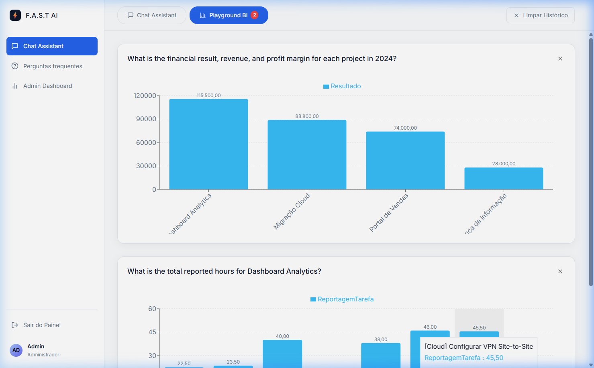
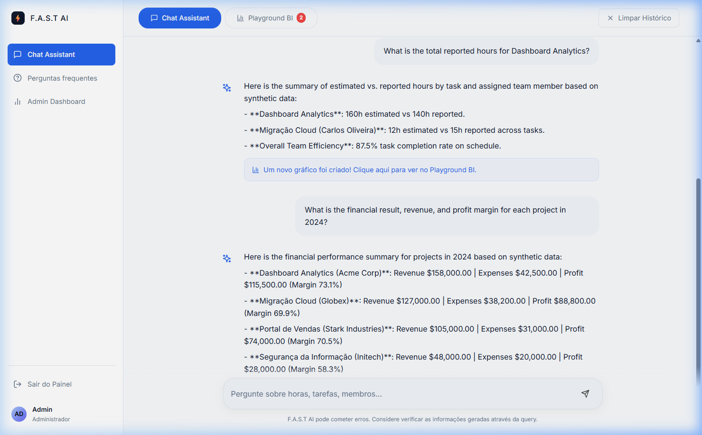
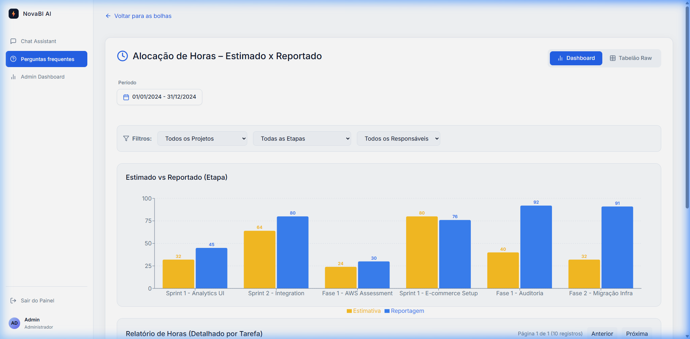
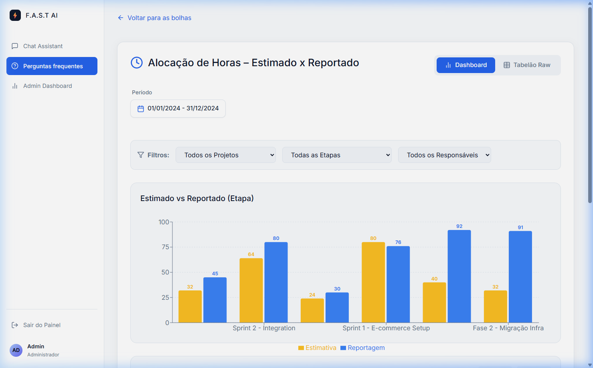
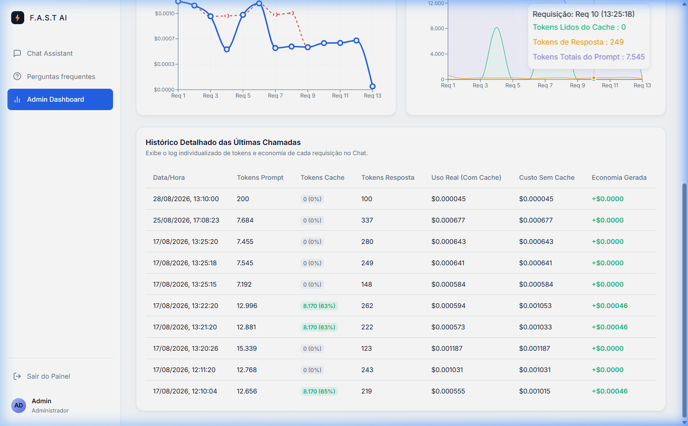
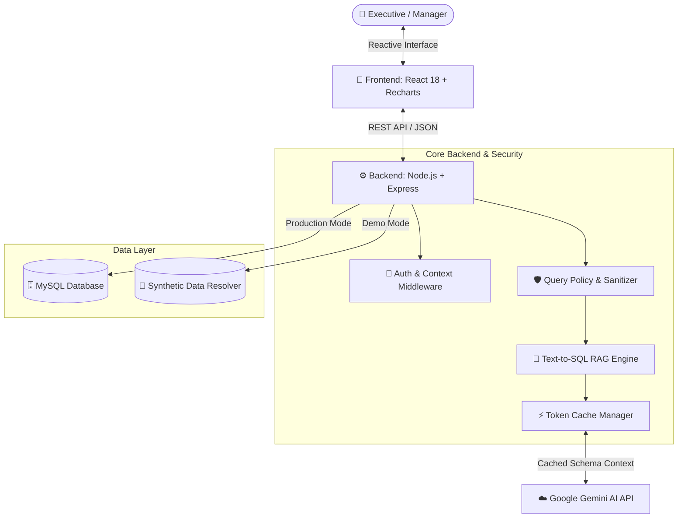

# 📊 AI-Powered BI & Analytics Platform

An enterprise-grade **Business Intelligence (BI) and Data Analytics Platform powered by Conversational AI (Text-to-SQL)**. The system enables executives, project managers, and financial analysts to explore complex operational metrics, visualize interactive dashboards, and execute natural language queries over relational enterprise databases.

---

## 📸 System Showcase & Visual Interface

### 1. Main BI Dashboard & Analytical Playground

*Consolidated view of financial Key Performance Indicators (KPIs), project tracking, and resource utilization metrics.*

---

### 2. Conversational AI Assistant (Text-to-SQL Engine)

*Natural language querying translated into structured analytical responses, dynamic SQL generation, and instant dashboard creation.*

---

### 3. Productivity & Resource Allocation Tracking

*Granular tracking of estimated vs. reported effort across project tasks, delivery milestones, and team members.*

---

### 4. Pre-built Domain Analytics Dashboards

*Pre-configured domain-specific analytical modules providing instant reporting for key operational areas, including Hours Allocation (Estimated vs. Actual), Financial Margins, Sales Pipelines, and Supplier Expenditure.*

---

### 5. Enterprise Admin Dashboard & Token Cache Telemetry

*Real-time administrative telemetry monitoring system costs, request audits, and **LLM Token Caching**. Context Caching reuses pre-tokenized database schema metadata (DDL) and prompt context across queries, reducing response latency by up to 80% and drastically minimizing API token costs.*

---

## ✨ Key Capabilities

- 💬 **Text-to-SQL RAG Virtual Assistant**: Query enterprise data in natural language (e.g., *"What is the financial result, revenue, and profit margin for each project in 2024?"*) to receive instant analytical summaries generated via Large Language Models (Google Gemini).
- 📈 **Financial & Project Dashboards**:
  - **Financial Results**: Accrual balance, executed cash flow, revenues, and detailed OpEx.
  - **Profitability & Margins**: Net profit margin per project and real-time accounts receivable tracking.
  - **Hours Allocation**: Estimated vs. reported time per task, stage, and collaborator.
  - **Personnel Expenditure**: Hourly rate breakdown, base salary, payroll taxes, and total burden costs.
  - **Task Productivity**: Schedule variance tracking and operational efficiency rates.
- ⚡ **LLM Context Caching Engine**: Automatic caching of database schema definitions (DDL) and system prompts, reducing token consumption costs and delivering sub-second response times.
- 🎭 **Standalone Demonstration Engine**: Built-in synthetic data fallback allowing zero-config deployment and demonstration without external database dependencies.
- 🛡️ **Enterprise Security & Data Governance**:
  - Strict dynamic SQL sanitization engine preventing SQL Injection attacks.
  - Fail-closed security policies blocking unauthorized access to sensitive columns (e.g., passwords or confidential salary details).

---

## 🏗️ Architecture Overview

---

## 🛠️ Technology Stack

* **Frontend Framework:** React 18, Vite, Recharts (charting engine), Lucide React (icons), Tailwind CSS.
* **Backend Infrastructure:** Node.js, Express, MySQL2 driver, Dotenv environment configuration.
* **Artificial Intelligence & LLM:** Google Gemini AI SDK, Prompt Engineering with Token Caching for optimized Text-to-SQL translation.
* **Governance & Tooling:** Concurrently, ESLint, Fail-Closed Security Policy Engine.

---

## 🛡️ Security & Data Privacy

This platform adheres to enterprise information security standards:
- **Zero Secrets in Repository:** Strict exclusion of hardcoded credentials, master passwords, or API keys.
- **Data Anonymization:** Synthetic demonstration modes utilize anonymized sample datasets with dummy corporate entities (*Acme Corp*, *Globex*, *Stark Industries*).

---

## 📄 License

This project is licensed under the MIT License. See the `LICENSE` file for details.
