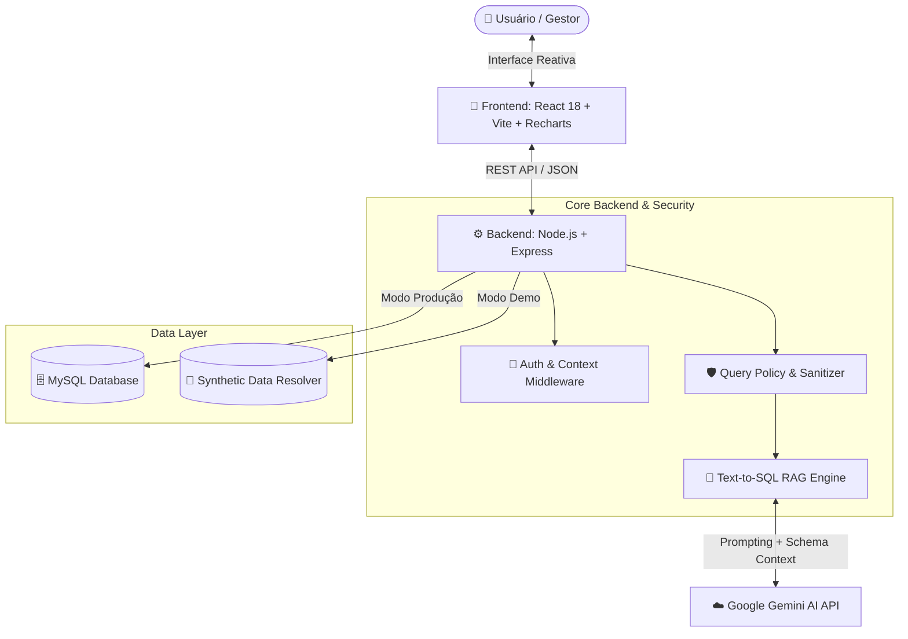

# 📊 AI-Powered BI & Analytics Platform

[](https://react.dev/)
[](https://vitejs.dev/)
[](https://nodejs.org/)
[](https://expressjs.com/)
[](https://www.mysql.com/)
[](https://ai.google.dev/)
[](LICENSE)

Plataforma corporativa de **Business Intelligence (BI) e Inteligência de Negócios impulsionada por IA Conversacional (Text-to-SQL)**. O sistema permite a executivos, gestores de projetos e analistas financeiros explorar relatórios operacionais complexos, visualizar dashboards interativos e realizar consultas analíticas em linguagem natural.

---

## 📸 Demonstração Visual (Screenshots)

> *Substitua as imagens abaixo adicionando suas capturas de tela na pasta `/docs/screenshots/`.*

### 1. Dashboard Principal & Módulos Analíticos

*Visão consolidadas de indicadores financeiros, acompanhamento de projetos e taxa de utilização.*

---

### 2. Assistente de IA Conversacional (Text-to-SQL)

*Consulta de dados em linguagem natural traduzida em tempo real para análises estruturadas e respostas sintéticas.*

---

### 3. Gestão de Produtividade & Horas

*Acompanhamento de esforço estimado vs. reportado por tarefa, etapa e colaborador.*

---

## ✨ Principais Funcionalidades

- 💬 **Assistente Virtual Text-to-SQL RAG**: Faça perguntas em português simples (ex: *"Qual foi o projeto mais lucrativo em 2024?"*) e receba respostas analíticas instantâneas geradas com auxílio da LLM (Google Gemini).
- 📈 **Dashboards Financeiros e de Projetos**:
  - **Resultado Financeiro**: Balanço de competência, caixa executado, receitas e despesas.
  - **Lucratividade & Margem**: Margem percentual por projeto e controle de contas em atraso.
  - **Alocação de Horas**: Estimado x Reportado por tarefa, colaborador e etapa.
  - **Gasto com Pessoal**: Custo hora, salário base, encargos e custo total da equipe.
  - **Produtividade e Tarefas**: Desvio de estimativas e taxa de eficiência operacional.
- 🎭 **Modo de Demonstração (100% Offline / Standalone)**: Funciona imediatamente sem depender de um banco de dados externo ou chaves pagas, utilizando um motor de dados sintéticos estáticos.
- 🛡️ **Camada Rígida de Segurança & Governança**:
  - Sanitização dinâmica de queries prevenindo ataques de SQL Injection.
  - Bloqueio *fail-closed* contra exibição de dados restritos e colunas de senhas ou salários confidenciais.

---

## 🏗️ Arquitetura do Sistema



---

## 🛠️ Tecnologias e Bibliotecas

* **Frontend:** React 18, Vite, Recharts (gráficos), Lucide React (ícones), Tailwind CSS / Vanilla CSS.
* **Backend:** Node.js, Express, MySQL2 (driver de banco), Dotenv.
* **Inteligência Artificial:** Google Gemini AI SDK, Prompt Engineering especializado para geração e sanitização de consultas analíticas.
* **Qualidade & Ferramentas:** Concurrently (execução simultânea), ESLint.

---

## 🚀 Como Executar o Projeto Localmente

### Pré-requisitos
* **Node.js** (v18.x ou superior)
* **npm** ou **yarn**

### 1. Clonar o repositório
```bash
git clone https://github.com/Lipefcleao/ai-powered-bi-platform.git
cd ai-powered-bi-platform
```

### 2. Instalar dependências
```bash
npm install
```

### 3. Configurar variáveis de ambiente
Crie um arquivo `.env` na raiz do projeto com base no arquivo `.env.example`:

```bash
cp .env.example .env
```

Para rodar em **Modo Demonstração (com dados sintéticos inclusos)**:
```env
DEMO_MODE=true
PORT=3001
VITE_GEMINI_API_KEY=sua_chave_opcional_aqui
```

### 4. Iniciar a aplicação
Rode o comando abaixo para disparar o servidor Backend (Express) e o servidor Frontend (Vite) simultaneamente:

```bash
npm run dev
```

Acesse a aplicação no navegador em: `http://localhost:5173` (ou no endereço exibido no terminal).

---

## 🛡️ Segurança & Privacidade de Dados

Este projeto segue diretrizes de segurança da informação:
- **Zero Secrets em Repositório:** O código não possui credenciais hardcoded, senhas master ou chaves de API expostas.
- **Isolamento de Dados Sensíveis:** O modo de demonstração utiliza apenas dados sintéticos (marcas e empresas fictícias como *Acme Corp*, *Globex*, *Stark Industries*).

---

## 📄 Licença

Este projeto está sob a licença MIT. Veja o arquivo `LICENSE` para mais detalhes.
